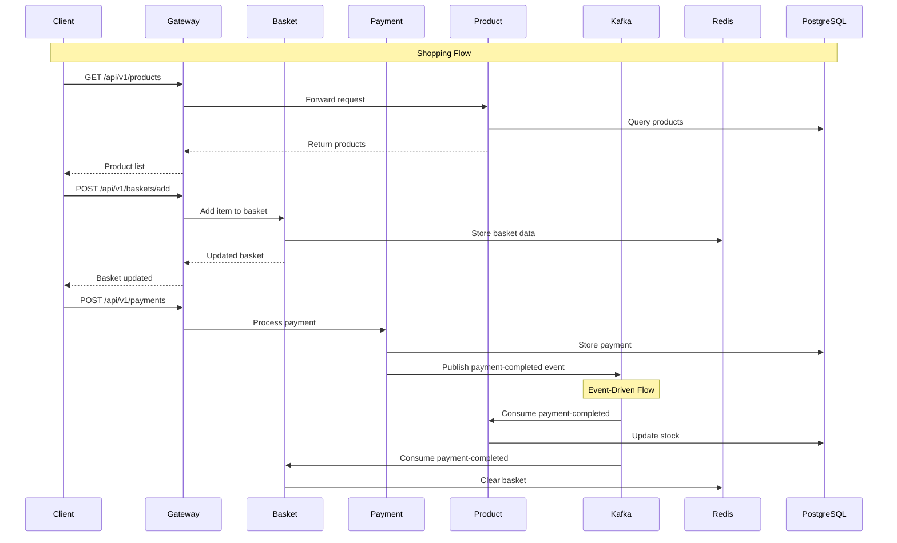
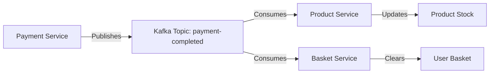

# DAPR Microservices E-Commerce Platform

A modern, event-driven microservices architecture built with Go, DAPR, Kafka, and Kubernetes. This project demonstrates a complete e-commerce platform with product management, payment processing, and shopping basket functionality.

## 🏗️ Architecture Overview


## 🔄 Event Flow Architecture



## 🚀 Quick Start

### Prerequisites

- Docker & Docker Compose
- Go 1.21+
- Kubernetes (Minikube/Docker Desktop)
- kubectl
- protoc (Protocol Buffers compiler)

### Local Development

1. **Clone the repository**
   ```bash
   git clone <repository-url>
   cd daprps
   ```

2. **Start with Docker Compose**
   ```bash
   docker-compose up -d
   ```

3. **Verify services**
   ```bash
   docker-compose ps
   ```

### Kubernetes Deployment

1. **Start Minikube**
   ```bash
   minikube start
   ```

2. **Deploy base resources**
   ```bash
   kubectl apply -k k8s/base
   ```

3. **Deploy development environment**
   ```bash
   kubectl apply -k k8s/overlays/dev
   ```

4. **Check deployment status**
   ```bash
   kubectl get all -n daprps-dev
   ```

## 📁 Project Structure

```
daprps/
├── api/proto/                 # Protocol Buffer definitions
│   ├── basket/
│   ├── payment/
│   ├── product/
│   └── events/
├── cmd/                       # Service entry points
│   ├── basket-service/
│   ├── payment-service/
│   └── product-service/
├── internal/                  # Business logic
│   ├── basket-service/
│   ├── payment-service/
│   └── product-service/
├── kafka/                     # Event streaming
│   ├── consumer/
│   └── publisher/
├── gingateway/               # API Gateway
├── dapr/                     # DAPR components
├── docker/                   # Docker configurations
├── k8s/                      # Kubernetes manifests
│   ├── base/
│   └── overlays/
└── docker-compose.yml
```

## 🔧 Services

### Product Service
- **Ports**: 8081 (HTTP), 50051 (gRPC)
- **Database**: PostgreSQL
- **Features**: Product CRUD, stock management
- **Events**: Consumes payment-completed events

### Payment Service
- **Ports**: 8082 (HTTP), 50052 (gRPC)
- **Database**: PostgreSQL
- **Features**: Payment processing, refunds
- **Events**: Publishes payment-completed events

### Basket Service
- **Ports**: 8083 (HTTP), 50053 (gRPC)
- **Database**: Redis (in-memory)
- **Features**: Shopping basket management
- **Events**: Consumes payment-completed events

### API Gateway (GinGateway)
- **Port**: 8080
- **Features**: Request routing, load balancing, CORS

## 🌐 API Endpoints

### Products
- `GET /api/v1/products` - List all products
- `GET /api/v1/products/{id}` - Get product by ID

### Payments
- `POST /api/v1/payments` - Process payment
- `GET /api/v1/payments/{id}` - Get payment status

### Basket
- `GET /api/v1/baskets/{user_id}` - Get user basket
- `POST /api/v1/baskets/add` - Add item to basket
- `POST /api/v1/baskets/remove` - Remove item from basket

## 🔄 Event Flow

### Payment Completed Event


## 🛠️ Development

### Building Services
```bash
# Build all services
make build

# Build specific service
make build-product
make build-payment
make build-basket
```

### Running Tests
```bash
# Run all tests
make test

# Run specific service tests
make test-product
```

### Code Generation
```bash
# Generate Protocol Buffer code
make proto
```

## 📊 Monitoring & Observability

- **Tracing**: Zipkin (Port 9411)
- **Logging**: Structured JSON logs
- **Health Checks**: `/health` endpoints
- **Metrics**: Prometheus-ready endpoints

## 🔒 Security

- Environment-based configuration
- Input validation
- SQL injection prevention (GORM)
- CORS configuration
- Request/Response logging

## 🚀 Deployment

### Docker Compose
```bash
# Development
docker-compose up -d

# Production
docker-compose -f docker-compose.prod.yml up -d
```

### Kubernetes
```bash
# Development
kubectl apply -k k8s/overlays/dev

# Production
kubectl apply -k k8s/overlays/prod
```

## 🤝 Contributing

1. Fork the repository
2. Create a feature branch
3. Make your changes
4. Add tests
5. Submit a pull request

## 📄 License

This project is licensed under the MIT License - see the [LICENSE](LICENSE) file for details.

## 🆘 Troubleshooting

### Common Issues

1. **Port conflicts**: Ensure ports 8080-8083, 50051-50053 are available
2. **Database connection**: Check PostgreSQL and Redis are running
3. **Kafka connectivity**: Verify Zookeeper and Kafka are healthy
4. **DAPR issues**: Check placement service and sidecar configurations

### Logs
```bash
# View service logs
docker-compose logs -f [service-name]

# View Kubernetes logs
kubectl logs -f deployment/[deployment-name] -n daprps-dev
```

## 📞 Support

For questions and support, please open an issue in the GitHub repository. 
